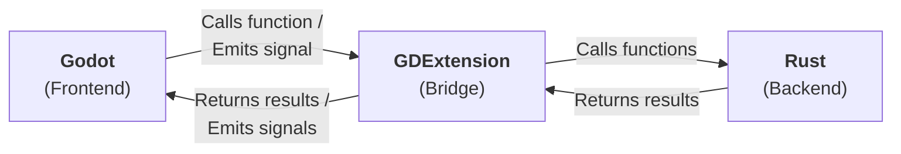
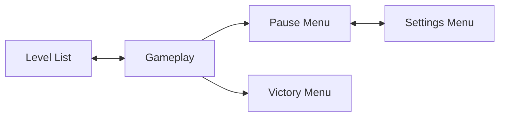
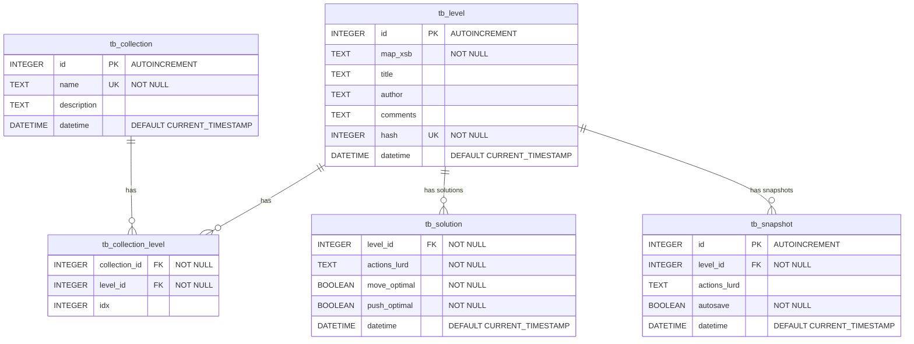

# Architecture

This document describes the high-level architecture of the project.

## Technology Stack

## Scenes

## Database

| Table Name            | Description                                                                          |
| --------------------- | ------------------------------------------------------------------------------------ |
| `tb_collection`       | Stores information about level collections                                           |
| `tb_level`            | Stores level information                                                             |
| `tb_collection_level` | Stores many-to-many relationships between collections and levels                     |
| `tb_solution`         | Saves the player's complete solution for a level (move/push optimal and non-optimal) |
| `tb_snapshot`         | Saves snapshots of level progress (auto/manual save)                                 |

